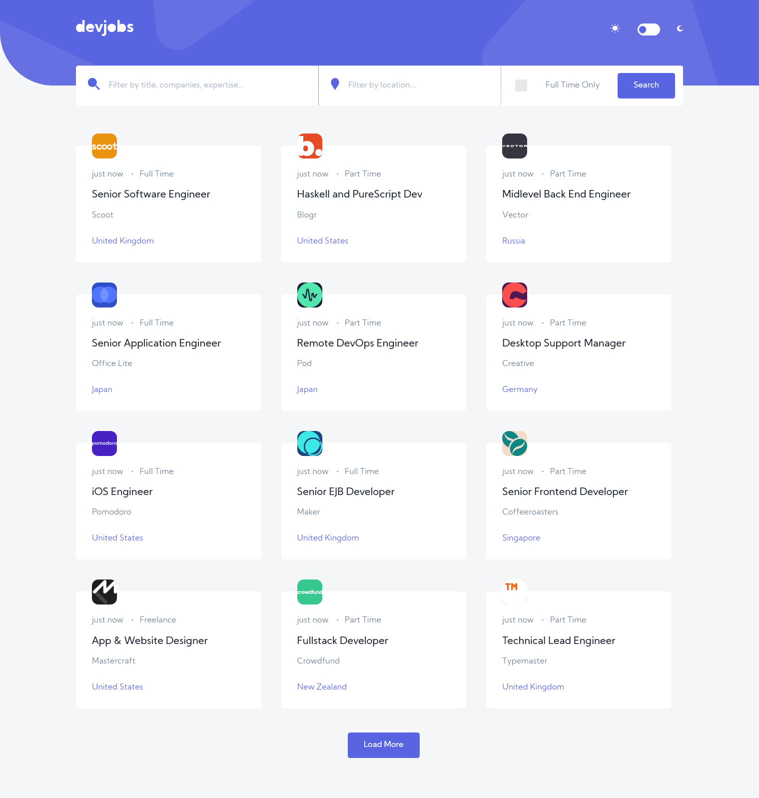

# Frontend Mentor - Devjobs web app solution

This is a solution to the [Devjobs web app challenge on Frontend Mentor](https://www.frontendmentor.io/challenges/devjobs-web-app-HuvC_LP4l).

## Table of contents

- [Overview](#overview)
  - [The challenge](#the-challenge)
  - [Screenshot](#screenshot)
  - [Links](#links)
- [My process](#my-process)
  - [Built with](#built-with)
  - [What I learned](#what-i-learned)
- [Author](#author)

**Note: Delete this note and update the table of contents based on what sections you keep.**

## Overview

### The challenge

Users should be able to:

- View the optimal layout for each page depending on their device's screen size
- See hover states for all interactive elements throughout the site
- Be able to filter jobs on the index page by title, location, and whether a job is for a full-time position
- Be able to click a job from the index page so that they can read more information and apply for the job
- **Bonus**: Have the correct color scheme chosen for them based on their computer preferences. _Hint_: Research `prefers-color-scheme` in CSS.

### Screenshot

### Links

- Live Site URL: [DevJobs App](https://dev-job-app.vercel.app/)

## My process

### Built with

- Semantic HTML5 markup
- CSS-in-JS
- Flexbox
- CSS Grid
- Desktop-first workflow
- [React](https://reactjs.org/) - JS library
- Costum elements from [Material UI](https://material-ui.com/)
- [React-Router-DOM](https://reactrouter.com/)

### What I learned

This project is the refactored version of the [GitHub-Jobs API](https://github.com/IlariaCallegari/GitHub-Jobs-API) project. The GitHub Jobs API was deprecated a few months ago, so I had to change the code to make it fetch the data from a JSON file instead. 

Going through the whole project once more, rethinking its overall structure, and identifying where the code needed changes and how to best implement those changes, was overall a beneficial exercise. 

One of the main points of learning has been around the useEffect hook. Whilst refactoring the code, I realised that the application was fetching data from the JSON file in an infinite loop and, it was re-rending the main page, slowing down considerably the app performance. Reading articles and documentation on how best to tackle the issue, has reinforced and deepened my understanding and the various implication of the useEffect hook.

### Useful resources

- [Example resource 1](https://www.example.com) - This helped me for XYZ reason. I really liked this pattern and will use it going forward.
- [Example resource 2](https://www.example.com) - This is an amazing article which helped me finally understand XYZ. I'd recommend it to anyone still learning this concept.

## Author

- Website - [Ilaria Callegari](https://www.ilariacallegari.com)
- GitHub - [@ilariacallegari](https://github.com/IlariaCallegari/)
